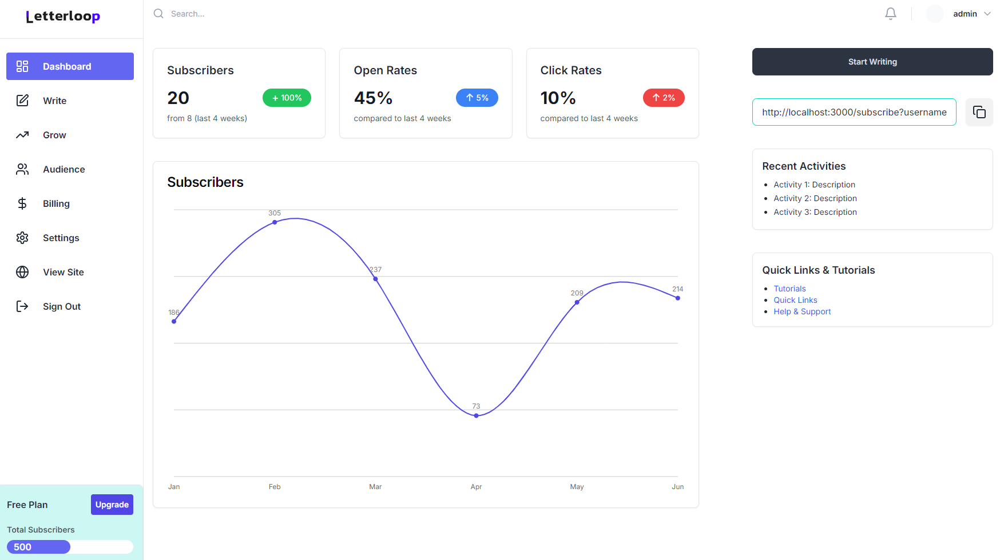

# Letterloop: Newsletter Management Application

## Overview

The Newsletter Management Application is a web-based platform designed to help users create, manage, and distribute newsletters efficiently. It provides a user-friendly interface for managing newsletter templates, subscribers, and drafts, making it easier for businesses and individuals to communicate effectively with their audience through email newsletters.

## Features

- **Newsletter Template Management**: Create, edit, and save newsletter templates using a visual editor.
- **Subscriber Management**: Add, view, and delete subscribers to manage your newsletter distribution list effectively.
- **Draft Management**: Save drafts of your newsletters and revisit them later for editing or sending.
- **Real-time Notifications**: Get instant feedback on actions such as adding or deleting subscribers.
- **Responsive Design**: The application is designed to be responsive, ensuring a seamless experience on both desktop and mobile devices.

## Technologies Used

- **Frontend**: React, Next.js, TypeScript, Tailwind CSS
- **Backend**: Node.js, Express.js
- **Database**: MongoDB
- **Authentication**: Kinde for user authentication
- **State Management**: React hooks for managing component state

## Getting Started

### Prerequisites

- Node.js (v14 or later)
- MongoDB (local or cloud instance)
- A Kinde account for authentication

### Installation

1. **Clone the repository**:
   ```bash
   git clone https://github.com/shouravrahman/letterloop.git
   cd newsletter-management-app
   ```

2. **Install dependencies**:
   ```bash
   npm install
   ```

3. **Set up environment variables**:
   Create a `.env.local` file in the root directory and add the following variables:
   ```plaintext
   MONGODB_URI=your_mongodb_connection_string
   KINDE_CLIENT_ID=your_kinde_client_id
   KINDE_CLIENT_SECRET=your_kinde_client_secret
   ```

4. **Run the application**:
   ```bash
   npm run dev
   ```

5. **Access the application**:
   Open your browser and navigate to `http://localhost:3000`.

## Usage

- **Creating Newsletter Templates**: Navigate to the newsletter editor to create and save your newsletter templates.
- **Managing Subscribers**: Use the Subscribers Management page to add or remove subscribers from your newsletter distribution list.
- **Drafting Newsletters**: Save your newsletter drafts and return to them later for editing or sending.

## Contributing

Contributions are welcome! If you have suggestions for improvements or new features, feel free to open an issue or submit a pull request.

## License

This project is licensed under the MIT License. See the [LICENSE](LICENSE) file for details.

## Acknowledgments

- Thanks to the contributors and the open-source community for their support and resources.
- Special thanks to Kinde for providing authentication services.
